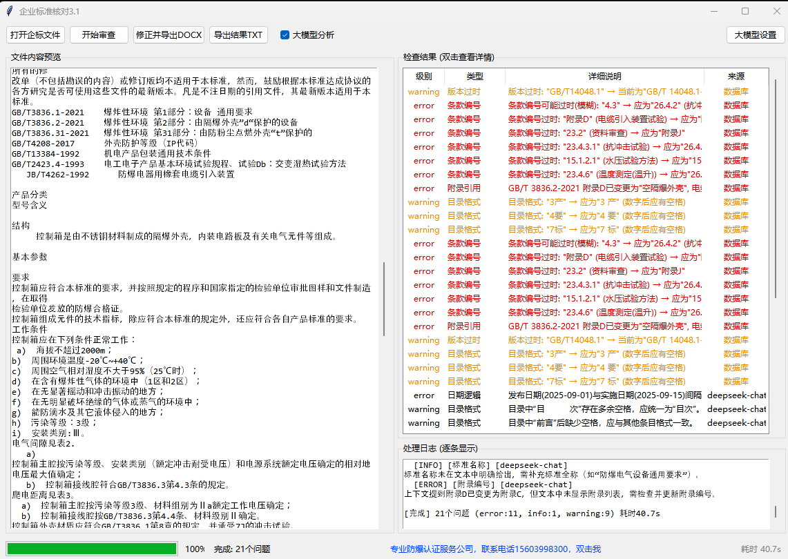
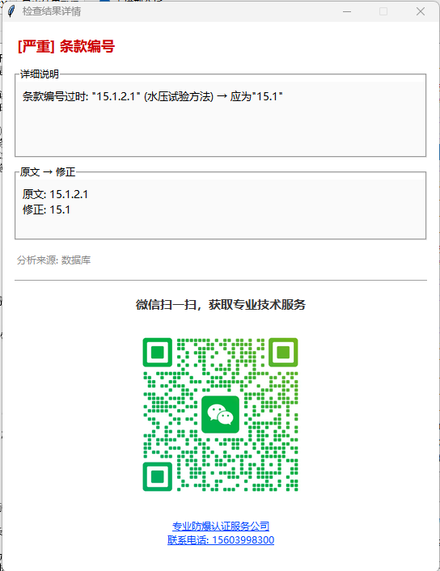
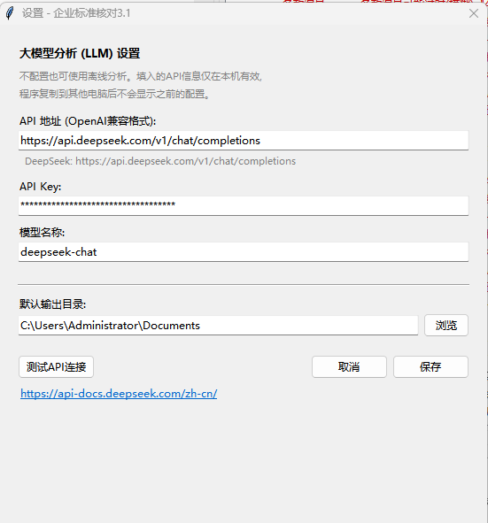

================================================================
  企业标准核对 — 智能审查修正系统
  Professional Enterprise Standard Review & Correction Tool
================================================================

> 本软件完全免费，由 AI 生成，供小白用户使用。
> 如有不同意见，请自行手工核对。
> 如需外包防爆认证服务，请从软件内联系作者。

一、产品简介
-----------
企业标准核对是一款专为防爆电气行业设计的企业标准智能审查与自动修正
工具。软件内置 GB/T 3836 系列国家标准数据库（3836.1/3836.2/3836.4/
3836.31-2021），可对企业的 .doc/.docx 格式标准文件进行全自动逐条审查，
精准识别条款引用错误、标准版本过时、附录编号错误、文本格式不合规等
15类常见问题，并自动生成黄底标注的修正版文档。

本软件采用预编译正则引擎、多线程并行分析、SQLite内存映射等优化技术，
处理速度比传统方法提升30%以上。

软件截图
-----------

二、核心功能
-----------
1. 多维度自动审查
   - 标准名称规范性检查（如"爆炸性气体环境"→"爆炸性环境"）
   - GB/T 3836 系列条款编号正确性验证（2010版→2021版映射）
   - 标准版本时效性检查（自动识别过时标准代号）
   - 附录引用完整性检查（如3836.2附录D→附录C迁移）
   - 内部条款引用一致性验证
   - 发布日期/实施日期逻辑校验
   - 目录格式规范化检查

2. 大模型增强分析（可选）
   - 支持配置 DeepSeek/OpenAI 等兼容API
   - LLM对低置信度问题进行二次确认
   - 发现数据库规则无法覆盖的隐蔽问题
   - API密钥本机加密存储，换机不泄露

3. 一键修正导出
   - 自动生成修正版 DOCX 文档
   - 修正处以黄底黑字醒目标注
   - 严格保留原文格式、字体、表格、插图
   - 支持 .doc 自动无损转换为 .docx

4. 检查结果管理
   - 问题列表显示级别/类型/来源/详情四维信息
   - 双击条目弹出完整详情+微信二维码
   - 一键导出 TXT 审查报告（含统计和来源分布）
   - 处理日志逐条实时显示

5. 辅助功能
   - 文件内容预览（.doc 自动转换预览）
   - 进度条+百分比+预估剩余时间
   - 蓝色闪烁联系方式（双击打开网页）
   - 微信二维码弹窗（扫一扫获取技术服务）

三、技术特点
-----------
- 数据库驱动：内置 SQLite 标准数据库（条款/版本/附录/替换规则）
- 零IO分析：启动时预加载全部缓存，审查过程无数据库等待
- 并行处理：ThreadPoolExecutor 多线程并行执行5项独立检查
- 灵活匹配：三级回退策略（精确→空白灵活→核心匹配），确保修正建议
  可靠应用到文档中
- 本机加密：API密钥基于MAC地址+主机名SHA256加密，复制到其他电脑
  无法解密

四、使用方法
-----------
1. 双击运行"企业标准核对3.1.exe"
2. 点击"打开企标文件"选择 .doc 或 .docx 文件
3. 可选：点击"大模型设置"配置LLM API（使用DeepSeek等）
4. 点击"开始审查"，等待分析完成
5. 查看检查结果列表，双击任意条目查看详情
6. 点击"修正并导出DOCX"生成修正版
7. 点击"导出结果TXT"保存审查报告

五、参照标准
-----------
- GB/T 3836.1-2021  爆炸性环境 第1部分：设备 通用要求
- GB/T 3836.2-2021  爆炸性环境 第2部分：由隔爆外壳"d"保护的设备
- GB/T 3836.4-2021  爆炸性环境 第4部分：由本质安全型"i"保护的设备
- GB/T 3836.31-2021 爆炸性环境 第31部分：由防粉尘点燃外壳"t"保护的设备
- GB/T 1.1-2020     标准化工作导则 第1部分：标准化文件的结构和起草规则

六、联系方式
-----------
专业防爆认证服务公司
联系电话：15603998300
官方网站：http://www.ex-fw.com

================================================================
  版本：企业标准核对 3.2
  更新日期：2026-05-24
================================================================